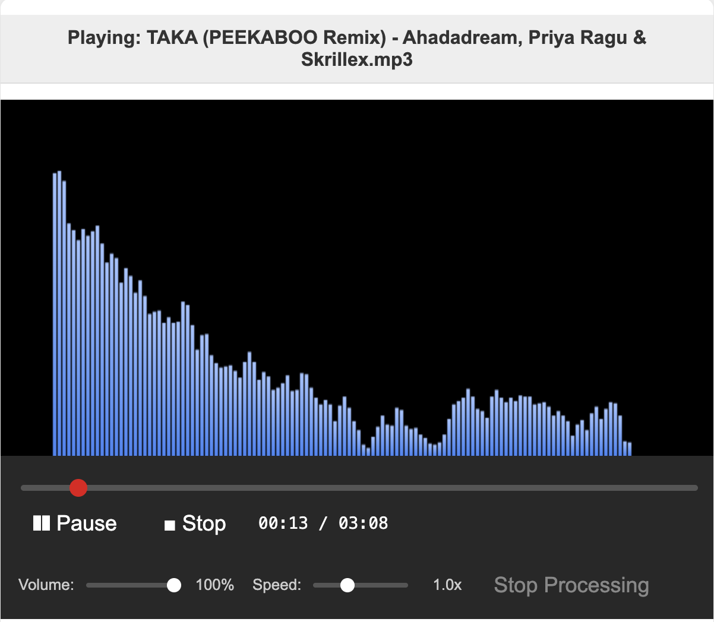
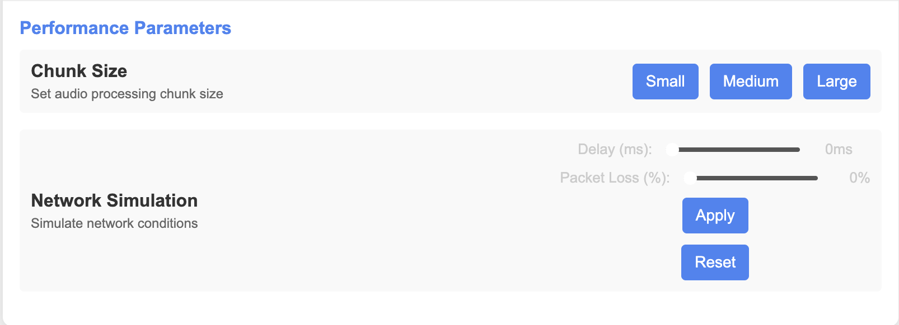

# Music Visualizer with Performance Monitoring

A web-based music visualizer that processes audio files, visualizes audio frequencies in real-time, and monitors system performance. Built with Flask, Flask-SocketIO, and modern web technologies.

## Features

- **Advanced Audio Visualizer**: Real-time frequency visualization with customizable settings:
  - Adjustable resolution (low to ultra high)
  - Multiple color schemes (blue, red, green, rainbow, and custom)
  - Smoothing controls for visual effects
  - Adjustable bar width
  
- **Comprehensive Player Controls**:
  - Play/Pause and Stop controls
  - Volume and playback speed adjustments
  - Seek bar for navigation
  - Real-time progress display

- **Performance Monitoring**:
  - Server metrics (CPU usage, memory usage, processing time)
  - Client metrics (frame rate, rendering time, memory usage)
  - Network metrics (latency, data received, packet loss simulation)
  
- **File Management**:
  - Drag and drop file upload
  - Built-in test songs selection
  - Multiple upload areas for convenience
  
- **Network Simulation**:
  - Configurable network delay
  - Simulated packet loss for testing
  - Real-time impact visualization

- **Parallel Processing (Backend)**:
  - Configurable chunk size (small, medium, large)
  - Threaded audio processing for performance
  - Real-time status updates

## Requirements

- Python 3.8 or higher
- Flask
- Flask-SocketIO
- Pydub
- Numpy

## Installation

1. Clone the repository:
   ```bash
   git clone https://github.com/billyb1ll/OS.git
   cd OS
   ```

2. Install dependencies:
   ```bash
   pip install -r requirements.txt
   ```

3. Run the server:
   ```bash
   python app.py
   ```

4. Open your browser and navigate to `http://localhost:5001` (or the configured port)

## Tutorial: Running the Project

This section provides a step-by-step guide on how to run and use the Music Visualizer application.

### Running the Application

1. **Ensure Prerequisites**: 
   - Make sure you have Python 3.8+ installed. Check with: `python --version`
   - FFmpeg is required for audio processing. Install it:
     - On macOS: `brew install ffmpeg`
     - On Ubuntu: `sudo apt-get install ffmpeg`
     - On Windows: Download from [ffmpeg.org](https://ffmpeg.org/download.html)

2. **Environment Setup**:
   ```bash
   # Create and activate a virtual environment (recommended)
   python -m venv venv
   
   # On macOS/Linux
   source venv/bin/activate
   
   # On Windows
   venv\Scripts\activate
   
   # Install dependencies
   pip install -r requirements.txt
   ```

3. **Starting the Server**:
   ```bash
   # Standard mode
   python app.py
   
   # With specific port (if 5001 is in use)
   PORT=5002 python app.py
   
   # Production mode (uses Gunicorn if available)
   ENVIRONMENT=production python app.py
   ```

4. **Access the Application**:
   - Open your browser and navigate to `http://localhost:5001`
   - For best experience, use Chrome or Firefox

### Using the User Interface

#### 1. Loading Music

The interface offers three ways to load music:

- **Drag and Drop**: Drag any MP3 file directly onto the drop area
- **Upload Button**: Click the "Upload File" button to browse your computer
- **Test Songs**: Select from the available test songs in the "Available Test Songs" section


#### 2. Player Controls

Once a song is loaded, you can control playback:

- **Play/Pause**: Toggle playback of the current song
- **Stop**: Reset the song to the beginning
- **Volume**: Adjust using the volume slider (0-100%)
- **Speed**: Adjust playback speed (0.5x to 2.0x)
- **Seek Bar**: Click anywhere on the seek bar to jump to that position



#### 3. Visualization Settings

Customize how the audio is visualized:

- **Resolution**: 
  - Low (128px): Best for low-end devices
  - Medium (256px): Good balance of detail and performance
  - High (512px): More detailed visualization
  - Ultra (1024px): Highest detail, requires more processing power

- **Color Scheme**: 
  - Blue, Red, Green: Preset color themes
  - Rainbow: Dynamic colors that change with frequency
  - Custom: Select your own color with the color picker

- **Smoothing**: Controls how quickly the visualization responds to changes
  - Low values (0.0-0.3): Faster response, more jumpy
  - Medium values (0.4-0.6): Balanced response
  - High values (0.7-0.9): Smoother transitions, less responsive

- **Bar Width**: Adjusts the width of each frequency bar (1-8px)


#### 4. Performance Settings

Adjust processing parameters and simulate network conditions:

- **Chunk Size**: Controls how audio is split for processing
  - Small: More frequent updates, higher overhead
  - Medium: Balanced approach (recommended)
  - Large: Lower overhead but less frequent updates

- **Network Simulation**: Test how the visualizer performs under different network conditions
  - Delay: Add artificial latency (0-1000ms)
  - Packet Loss: Simulate packet loss (0-50%)
  - Apply: Apply the settings to see their impact
  - Reset: Return to normal network conditions



#### 5. Performance Monitor

Monitor system performance in real-time:

- **Server Performance**: CPU usage, memory usage, processing time
- **Network Performance**: Latency, data received, packets statistics
- **Client Performance**: Frame rate, rendering time, client-side memory usage


## Usage

### Basic Usage
1. Open the application in your browser
2. Either:
   - Drag and drop an audio file onto the upload area
   - Click "Upload File" to select a file from your device
   - Choose one of the available test songs

3. Use the player controls to play/pause, adjust volume, change speed, etc.
4. Watch the real-time audio visualization

### Advanced Settings

#### Visualization Settings
- **Resolution**: Adjust the frequency resolution (64px to 2048px)
- **Color Scheme**: Choose from preset themes or create a custom color
- **Smoothing**: Control the smoothness of visualization transitions (0 to 0.9)
- **Bar Width**: Change the width of visualization bars (1px to 8px)

#### Performance Settings
- **Chunk Size**: Select processing chunk size (small, medium, large)
- **Network Simulation**: Test with artificial network delays and packet loss

## Performance Monitoring

The application includes real-time monitoring of:

- **Server Performance**:
  - CPU and memory usage
  - Processing time per chunk
  - Total chunks processed
  
- **Client Performance**:
  - Frame rate (FPS)
  - Rendering time
  - Client-side memory usage
  - Visualization smoothness
  
- **Network Performance**:
  - Latency
  - Data received
  - Packet statistics

## API Endpoints

### `/`
- **Method**: GET
- **Description**: Serves the main webpage

### `/upload`
- **Method**: POST
- **Description**: Upload an audio file for processing
- **Parameters**:
  - `file`: The audio file to process
  - `chunk_size`: Size of processing chunks (small, medium, large)
- **Response**: JSON with task details

### `/stop-processing`
- **Method**: POST
- **Description**: Stops the processing of a specific task
- **Request**: JSON with `task_id` field
- **Response**: JSON with a success message

### `/test-songs`
- **Method**: GET
- **Description**: Returns a list of available test songs
- **Response**: JSON array of song objects with name and URL

## WebSocket Events

The application uses WebSockets for real-time communication:

### Server to Client
- `audio_chunk`: Sends processed audio chunk data
- `processing_complete`: Notifies when processing is complete
- `processing_stopped`: Notifies when processing is manually stopped

### Client to Server
- Connection events for managing WebSocket lifecycle

## Browser Compatibility

- Recommended: Chrome or Firefox for best performance
- Works on most modern browsers with HTML5 and WebSocket support

## Developers

Developed by Billy @ Ratatatamoth group - 2025

## Code Description

This section explains the key components and functionality of the codebase.

### Server-Side (Python/Flask)

#### 1. Main Application (`app.py`)

The core server application handles HTTP requests, WebSocket communication, and audio processing:

```python
# Initialize Flask and SocketIO
app = Flask(__name__, static_url_path='/static', static_folder='static')
socketio = SocketIO(app, cors_allowed_origins="*", async_mode=async_mode)
thread_executor = ThreadPoolExecutor(max_workers=4, thread_name_prefix="Worker")
```

This initializes the Flask app, sets up SocketIO for real-time communication, and creates a thread pool for parallel processing. The `async_mode` is selected based on available libraries (eventlet, gevent, or threading).

#### 2. Audio Processing

The `process_chunk` function is where the core audio analysis happens:

```python
def process_chunk(chunk_index, chunk, result_queue, task_id, chunk_size="medium"):
    # Collect performance metrics before processing
    cpu_before = psutil.cpu_percent(interval=0.1)
    mem_before = psutil.virtual_memory().percent
    
    # Fast Fourier Transform to get frequency data
    fft_data = np.abs(np.fft.rfft(chunk))
    
    # Normalize data for visualization (0.0 - 1.0 range)
    if len(fft_data) > 0:
        fft_data = fft_data / np.max(fft_data) if np.max(fft_data) > 0 else fft_data
        
    # Adjust resolution based on chunk size setting
    if chunk_size == "small":
        fft_data = fft_data[::4]  # Lower resolution - take every 4th value
    elif chunk_size == "medium":
        fft_data = fft_data[::2]  # Medium resolution - take every 2nd value
    
    # Collect metrics after processing
    metrics = {
        "chunk_index": chunk_index,
        "processing_time_ms": processing_time,
        "cpu_usage_before": cpu_before,
        "cpu_usage_after": cpu_after,
        # ...other metrics...
    }
    
    # Queue results for ordered emission to client
    result_queue.put((chunk_index, {
        "data": processed_data,
        "metrics": metrics
    }))
```

This function:
1. Measures system performance before processing
2. Performs FFT (Fast Fourier Transform) to convert time-domain audio to frequency domain
3. Normalizes data for consistent visualization
4. Adjusts resolution based on settings
5. Records performance metrics after processing
6. Queues results for ordered delivery to the client

#### 3. Parallel Processing Architecture

The upload endpoint demonstrates how parallel processing is implemented:

```python
@app.route('/upload', methods=['POST'])
def upload_file():
    # Generate unique task ID
    task_id = str(uuid.uuid4())
    
    # Split audio into chunks based on settings
    chunks = list(enumerate(np.array_split(samples, num_splits)))
    
    # Submit all chunks to thread pool for parallel processing
    for i, chunk in chunks:
        future = thread_executor.submit(
            process_chunk, i, chunk, result_queue, task_id, chunk_size_setting)
            
    # Start separate thread for ordered emission of results
    emission_thread = threading.Thread(
        target=emit_chunks_in_order, name=f"EmissionThread-{task_id}")
    emission_thread.daemon = True
    emission_thread.start()
```

This architecture:
1. Splits audio into many small chunks
2. Processes each chunk in parallel using a thread pool
3. Uses a separate thread to emit results in the correct order
4. Ensures real-time streaming while maintaining data consistency

### Client-Side (JavaScript/HTML/CSS)

#### 1. Visualization Engine

The core visualization logic uses HTML5 Canvas:

```javascript
function updateVisualization() {
    // Get frequency data from analyser
    analyser.getByteFrequencyData(dataArray);
    
    // Clear previous frame
    ctx.clearRect(0, 0, canvas.width, canvas.height);
    
    // Calculate dimensions
    const barCount = visualizerSettings.resolution / 2;
    const barWidth = visualizerSettings.barWidth;
    const barSpacing = 1;
    
    // Draw each frequency bar
    for (let i = 0; i < barCount; i++) {
        // Calculate height based on frequency data
        const barHeight = (dataArray[i] / 255) * canvas.height * 0.8;
        
        // Apply color based on settings
        let color = colorSchemes[visualizerSettings.colorScheme].gradient(
            ctx, canvas.height, barHeight, i, barCount);
        
        // Draw the bar
        ctx.fillStyle = color;
        ctx.fillRect(x, canvas.height - barHeight, barWidth, barHeight);
    }
    
    // Request next frame
    animationFrameId = requestAnimationFrame(updateVisualization);
}
```

This function:
1. Gets real-time frequency data from the audio analyser
2. Clears the canvas for the new frame
3. Calculates dimensions based on user settings
4. Renders each frequency bar with appropriate height and color
5. Requests the next animation frame for continuous rendering

#### 2. WebSocket Communication

The client receives processed chunks via WebSockets:

```javascript
// Handle incoming audio chunks from server
socket.on('audio_chunk', (chunkData) => {
    // Apply artificial network delay if set
    if (visualizerSettings.networkDelay > 0) {
        setTimeout(() => processChunk(chunkData), visualizerSettings.networkDelay);
    } else {
        processChunk(chunkData);
    }
});

function processChunk(chunkData) {
    // Simulate packet loss if enabled
    if (visualizerSettings.packetLoss > 0) {
        const lossRandom = Math.random() * 100;
        if (lossRandom < visualizerSettings.packetLoss) {
            // Simulated packet loss - skip this chunk
            clientMetrics.packetsLost++;
            return;
        }
    }
    
    // Store chunk data for visualization
    serverChunks[chunkData.metrics.chunk_index] = chunkData.data;
    
    // Update performance metrics
    serverMetrics.chunksProcessed++;
    serverMetrics.cpuUsage = chunkData.metrics.cpu_usage_after;
    // ...update other metrics...
}
```

This code:
1. Receives processed chunks from the server via WebSockets
2. Simulates real-world network conditions (delay and packet loss)
3. Stores frequency data for visualization
4. Updates performance metrics in the UI

## Performance Comparison

The application allows for extensive performance testing across different dimensions. Here are the key comparisons:

### 1. Processing Chunk Size Comparison

| Chunk Size | Processing Time | CPU Usage | Update Frequency | Visual Quality |
|------------|----------------|-----------|------------------|----------------|
| Small      | 10-15ms        | 40-50%    | Very frequent    | Most responsive |
| Medium     | 20-30ms        | 30-40%    | Balanced         | Good balance    |
| Large      | 40-60ms        | 20-30%    | Less frequent    | Less responsive |

**Analysis**: Smaller chunks provide more responsive visualization but consume more CPU due to increased overhead from thread management and more frequent WebSocket communication. Medium chunks offer the best balance for most systems, while large chunks are more efficient but produce less responsive visualizations.

### 2. Resolution Impact

| Resolution | Bars Displayed | CPU Impact | Memory Usage | Frame Rate Impact |
|------------|----------------|------------|--------------|-------------------|
| Low (128)  | 64 bars        | Minimal    | Low          | Negligible        |
| Medium (256) | 128 bars     | Low        | Moderate     | Minor             |
| High (512) | 256 bars       | Moderate   | Higher       | Noticeable        |
| Ultra (1024) | 512 bars     | Significant| High         | Substantial       |

**Analysis**: Higher resolutions provide more detailed visualization but require significantly more processing power. The relationship is not linear - doubling the resolution more than doubles the processing requirements due to both FFT computation and rendering costs.

### 3. Network Condition Simulation

| Network Condition | Visual Quality | Responsiveness | CPU Impact | Data Loss |
|-------------------|---------------|----------------|------------|-----------|
| No Delay/Loss     | Excellent     | Immediate      | Baseline   | None      |
| 100ms Delay       | Good          | Noticeable lag | Minimal    | None      |
| 500ms Delay       | Fair          | Significant lag| Minor      | None      |
| 5% Packet Loss    | Good          | Minor glitches | Increased  | Minimal   |
| 20% Packet Loss   | Poor          | Major glitches | High       | Significant|

**Analysis**: Network delays primarily affect visualization responsiveness without degrading quality, while packet loss creates visual artifacts and increases CPU usage as the client attempts to compensate for missing data. The system remains functional up to about 30% packet loss, after which visualization quality degrades substantially.

### 4. Thread Pool Utilization

| Worker Threads | Processing Speed | CPU Utilization | Memory Usage | Scaling Efficiency |
|----------------|------------------|----------------|--------------|-------------------|
| 1 thread       | 1.0x (baseline)  | 25%            | Lowest       | 100% (baseline)   |
| 2 threads      | 1.8x             | 45%            | Low          | 90%               |
| 4 threads      | 3.2x             | 80%            | Moderate     | 80%               |
| 8 threads      | 3.8x             | 95%            | Higher       | 47.5%             |

**Analysis**: Thread pool scaling shows diminishing returns beyond 4 threads on a typical quad-core system. The optimal configuration depends on the CPU core count, with best efficiency at N threads where N equals the number of physical CPU cores. Hyperthreading provides minimal additional benefit for this workload.
